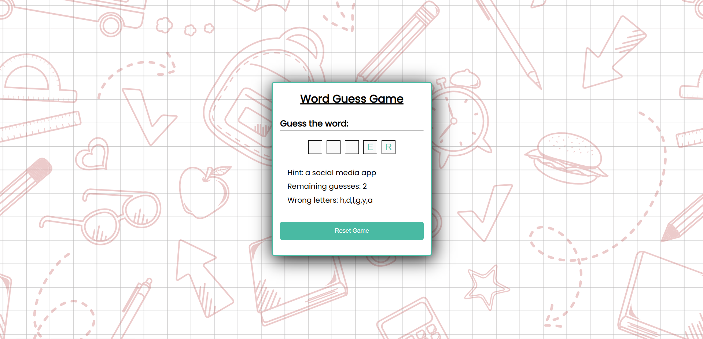

## Word Guess Game
A fun and interactive Word Guessing Game where players guess a hidden word by suggesting letters within a certain number of attempts. This game provides an engaging way to improve your vocabulary and have fun with friends or solo.

## Features
- Word Selection: Random words are chosen from a predefined list.
- Guess Letters: Players can guess one letter at a time.
- Attempts Counter: The game tracks the number of attempts left.
- Word Reveal: As players guess letters correctly, the word starts to reveal itself.
- Game Over: The game ends when either the word is fully guessed or the attempts are exhausted.

## Installation
1. Clone the repository:
     ```bash
     git clone https://github.com/yourusername/word_guess_game.git
     ```
2. Navigate to the project directory:
     ```bash
     cd word_guess_game
     ```
3. Open the index.html file in your browser to start playing the game.

## Usage
1. Start the Game:
Once you open the game in your browser, it will prompt you to guess a letter.
2. Guess Letters:
Type a letter and submit your guess.
3. Track Progress:
As you guess correctly, the letters of the word will be revealed.
If you guess wrong, your attempts will decrease.
4. Game Over:
The game ends when you either guess the word correctly or run out of attempts.

## Technologies Used
- HTML: The structure of the game interface.
- CSS: For styling the game interface to make it visually appealing.
- JavaScript: The logic behind the word guessing mechanism, handling user input, and game state management.

## Project Structure
Here is an overview of the project files:

- index.html: Contains the HTML structure, including the layout and display of the game elements.
- style.css: Styles the page and the game elements to make the user experience better.
- script.js: Implements the core game logic, including word selection, guesses, attempts counter, and game status.

## UI Structure

